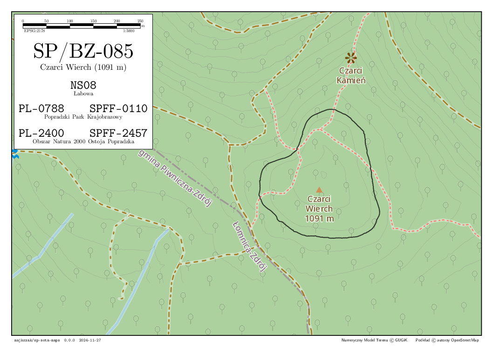

SP SOTA MAPS
============



Aim of the project is to prepare a set of SOTA activation cheatsheet maps congaing the activation zone and other useful
features, like grid square reference or nearby references from other programs.

Due to the data sources used, the coverage of the project is limited to SP region and neighbours border summits.


Python helper library
---------------------

### Installation

```sh
pip install --user --break-system-packages --verbose ./lib
```

### Baking the cache

Filesystem cache is used by the library to reduce heavy repetitive calculations and load on the data servers.
Cache directory is specified by the `SOTA_CACHE` environment variable and defaults to `./cache`.

Baking process is recommended if all or bigger amount of summits will be processed.
In case of processing only one summit, it is enough to relay on the on demand cache generation.

To run the baking, execute the following:

```sh
python -m sota.scripts.bake_cache
```

### Rendering map layers

All maps layers will be plotted and saved as pdf files.
Output directory is sepcified by the `SOTA_OUTPUT` environment variable and defaults to `./output`.

Aditionally, OpenStreetMap Carto have to be prepared according to: https://github.com/gravitystorm/openstreetmap-carto/blob/master/DOCKER.md
Poland OSM data is required: https://download.geofabrik.de/europe/poland-latest.osm.pbf

To run the map plotting process, execute the following:

```sh
python -m sota.scripts.render
```

TODO-s
------

- Hmap bounding box have Y-s swapped.
- Use masked array in Hmap-s
- Improve render_carto to not look like a crap
- Split carto layer rendering
- Fix nasty PGA and Parks lists
- Unify font sizes
- etc...
