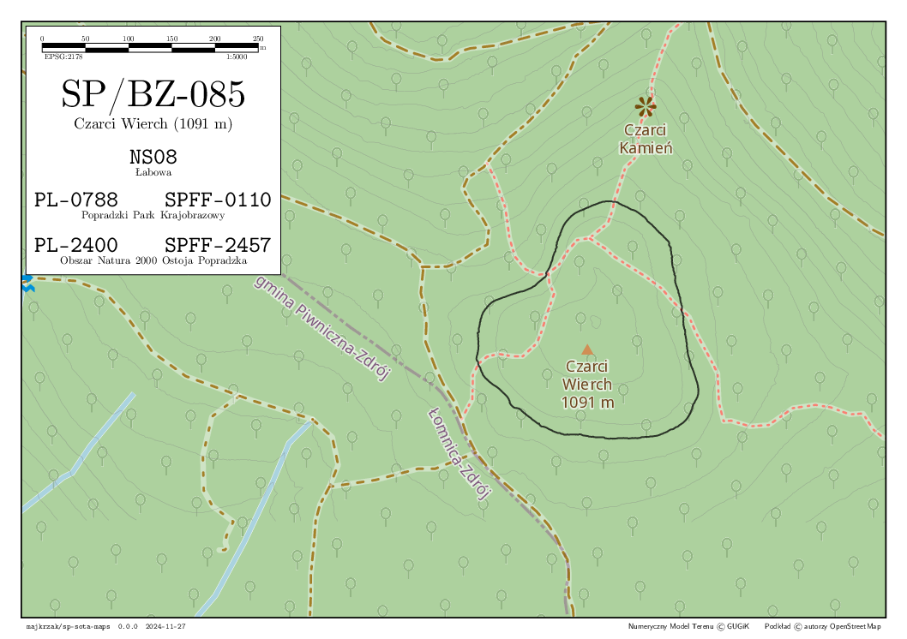

# SP SOTA MAPS



The aim of the project is to prepare a set of SOTA activation cheat sheet maps containing an activation zone and other useful features, like grid square references or nearby references from other programs.

Due to the data sources used, the coverage of the project is limited to SP region and neighbours border summits.

## Python helper utility

### Setup

The recommended way of getting the `sota` helper utility into the scope, together with all its dependencies, is via the [`nix shell`](https://nix.dev/manual/nix/latest/command-ref/new-cli/nix3-env-shell.html) command.

```shell
nix shell github:majkrzak/sp-sota-maps
```

> [!NOTE]
> Due to the OpenStreetMap data dependencies and its size, the build process can take up to 2 hours and result in about 20 GiB of disk space consumed.
> If base map rendering is not required, the `sota` python package can be explicitly used instead of default one.

### Baking or preloading the cache

A file system cache is used by the library to reduce heavy, repetitive calculations and load on the data servers.
The cache directory is specified by the `SOTA_CACHE` environment variable and defaults to `./cache`.

Baking process is recommended if all or bigger amount of summits will be processed.
In case of processing only one summit, it is enough to relay on the on demand cache generation.

To run the baking, execute the following:

```shell
sota cache bake
```

Alternatively, the cache can be preloaded from the GitHub release by executing the following:

```shell
sota cache preload
```

> [!CAUTION]
> Cache uses `pickle` as a storage format, which allows arbitrary code execution during unpickling.
> Ensure you trust me and the GitHub.

### Rendering map layers and other files

All map layers will be plotted and saved as PDF files. Besides that, TEX and other files will be generated.
The output directory is specified by the `SOTA_OUTPUT` environment variable and defaults to `./output`.

> [!NOTE]
> In case of a non-Nix setup:
> additionally, to render the base map layer, OpenStreetMap Carto has to be present under the directory which has to be provided via the `CARTO_DIR` environment variable.
> OpenStreetMap data covering the summits has to be preprocessed and placed in the PostgreSQL database.
> See the [OpenStreetMap Carto installation instructions](https://github.com/openstreetmap-carto/openstreetmap-carto/blob/master/INSTALL.md).
> OpenStreetMap data of Poland can be downloaded from [geofabrik.de](https://download.geofabrik.de/europe/poland-latest.osm.pbf).

To run the rendering process, execute the following:

```shell
sota render
```

### Typeset the result

Final typesetting have to be done with `lualatex`.
Recommended way is to do it is with `latexmk`. This ensures files are generated correctly.

The output directory is specified by the `SOTA_OUTPUT` environment variable and defaults to `./output`.

To run the final typesetting, execute the following:

```shell
latexmk -lualatex -output-directory=$SOTA_OUTPUT $SOTA_OUTPUT/*.tex
```
